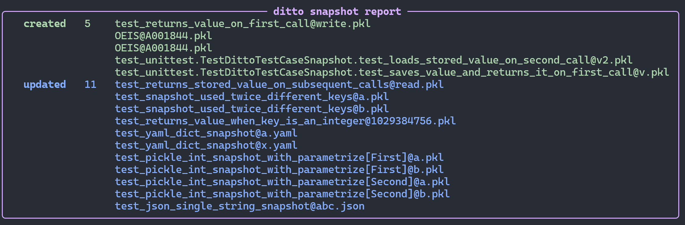
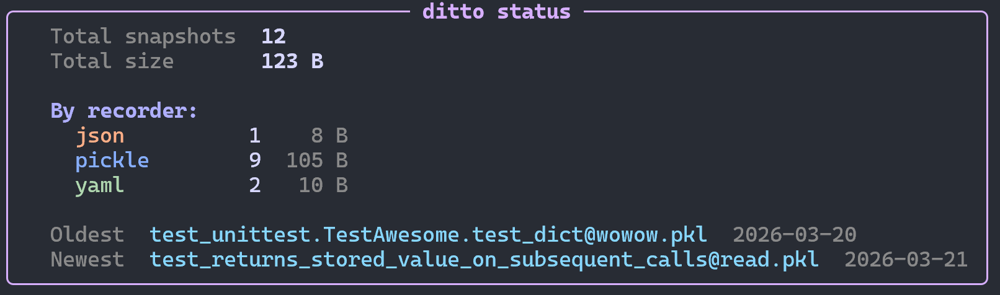
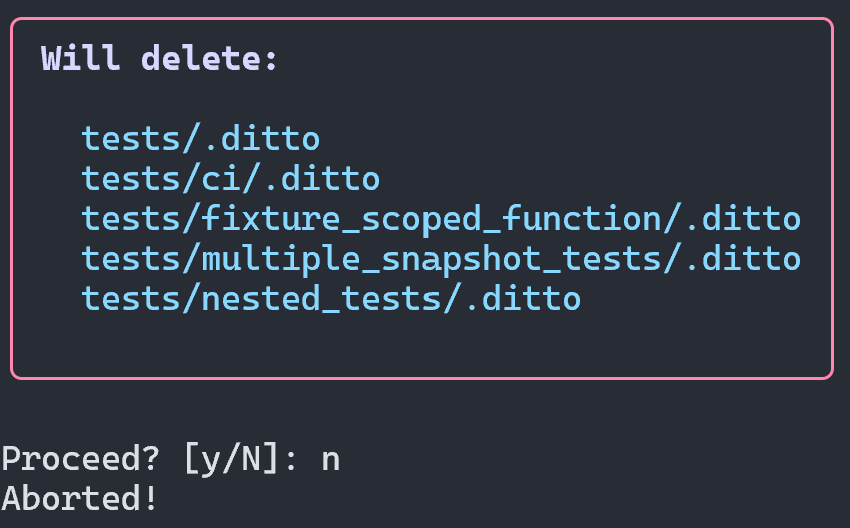
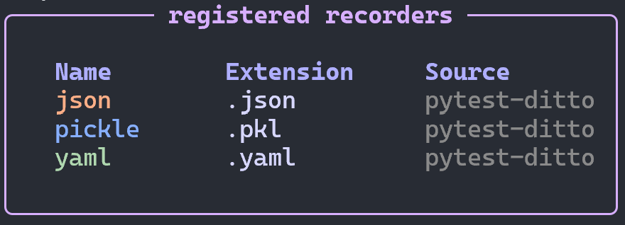

# pytest-ditto
[](https://badge.fury.io/py/pytest-ditto)
[](https://github.com/owlowlyowl/pytest-ditto/actions/workflows/ci.yml)

Snapshot testing pytest plugin with minimal ceremony and flexible recorders.

## Introduction
The `pytest-ditto` plugin is intended to be used for snapshot/regression testing. There are
two key components: the `snapshot` fixture and snapshot recorders.

### The `snapshot` Fixture
In the following basic example, the function to test is `fn`, the test is using the
`snapshot` fixture and it is asserting that the result of calling `fn` with the
value of `x` does not change.


```python
import ditto


def fn(x: int) -> int:
    return x + 1  # original implementation
    # return x + 2  # new implementation


def test_fn(snapshot) -> None:
    x = 1
    result = fn(x)
    assert result == snapshot(result, key="fn")
```

The first time the test is run, the `snapshot` fixture takes the data passed to it and
persists it to a `.ditto` directory in the same location as the test module. Subsequent
test runs load the stored file and use that value for comparison.

By default, snapshot data is persisted using `pickle`; however, a range of recorders
can be selected per test using `ditto` marks.

### @ditto Marks
If the default recorder (`pickle`) isn't appropriate, a different recorder can be
specified per test using `ditto` marks — customised `pytest` mark decorators.

The built-in recorders are:

| Mark | Recorder | File extension |
| --- | --- | --- |
| `@ditto.pickle` | pickle | `.pkl` |
| `@ditto.yaml` | yaml | `.yaml` |
| `@ditto.json` | json | `.json` |
| `@ditto.record("name")` | any registered recorder | varies |

`@ditto.pickle`, `@ditto.yaml`, and `@ditto.json` are convenience shorthands for
`@ditto.record("pickle")`, `@ditto.record("yaml")`, and `@ditto.record("json")`
respectively.

Additional recorders can be installed via plugins:

| Recorders | Plugin | Marks |
| --- | --- | --- |
| `pandas` | `pytest-ditto-pandas` | <ul><li>`@ditto.pandas.parquet`</li><li>`@ditto.pandas.json`</li><li>`@ditto.pandas.csv`</li> |
| `pyarrow` | `pytest-ditto-pyarrow` | <ul><li>`@ditto.pyarrow.parquet`</li><li>`@ditto.pyarrow.feather`</li><li>`@ditto.pyarrow.csv`</li> |


## Usage

### `pd.DataFrame`

Install `pytest-ditto[pandas]` to make `pandas` recorders available.

```python
import pandas as pd

import ditto


def awesome_fn_to_test(df: pd.DataFrame):
    df.loc[:, "a"] *= 2
    return df


@ditto.pandas.parquet
def test_fn_with_parquet_dataframe_snapshot(snapshot):
    input_data = pd.DataFrame({"a": [1, 2, 3], "b": [4, 5, 9]})
    result = awesome_fn_to_test(input_data)
    pd.testing.assert_frame_equal(result, snapshot(result, key="ab_dataframe"))


@ditto.pandas.json
def test_fn_with_json_dataframe_snapshot(snapshot):
    input_data = pd.DataFrame({"a": [1, 2, 3], "b": [4, 5, 9]})
    result = awesome_fn_to_test(input_data)
    pd.testing.assert_frame_equal(result, snapshot(result, key="ab_dataframe"))
```

For the above example the snapshot files would be found in the following locations:
- `.ditto/test_fn_with_parquet_dataframe_snapshot@ab_dataframe.pandas.parquet`
- `.ditto/test_fn_with_json_dataframe_snapshot@ab_dataframe.pandas.json`


### `pyarrow.Table`

Install `pytest-ditto[pyarrow]` to make `pyarrow` recorders available.

```python
import pyarrow as pa
import pyarrow.compute as pc
import ditto
import pytest


@pytest.fixture
def table() -> pa.Table:
    return pa.table(
        [
            [1, 2, 3, 4],
            [4.5, 5.2, 6.8, 3.5],
            [7, 8.5, None, None],
            [True, False, True, True],
            ["a", "b", "c", "x"],
        ],
        names=list("abcde"),
    )


def fn(x: pa.Table):
    even_filter = (pc.bit_wise_and(pc.field("a"), pc.scalar(1)) == pc.scalar(0))
    return x.filter(even_filter)


@ditto.pyarrow.parquet
def test_fn_with_pyarrow_parquet_snapshot(snapshot, table):
    result = fn(table)
    assert result.equals(snapshot(result, key="filtered"))
```

For the above example the snapshot files would be found in the following location:
- `.ditto/test_fn_with_pyarrow_parquet_snapshot@filtered.pyarrow.parquet`


### `unittest.TestCase`

`DittoTestCase` provides the `snapshot` fixture as a `cached_property` for use with
`unittest.TestCase`:

```python
import unittest
from ditto import DittoTestCase


def fn(x: int) -> int:
    return x + 1


class TestFn(DittoTestCase):
    def test_fn(self):
        result = fn(1)
        assert result == self.snapshot(result, key="fn")
```

Snapshot files are placed in a `.ditto` directory adjacent to the test file, using the
fully-qualified test method name as the group name.


## Custom Recorders

A `Recorder` is a frozen dataclass pairing a file extension with `save` and `load`
functions. Plugin packages register `Recorder` instances via the `ditto_recorders`
entry point group.

```python
from pathlib import Path
from ditto.recorders import Recorder


def _save(data: MyType, filepath: Path) -> None:
    ...  # write data to filepath


def _load(filepath: Path) -> MyType:
    ...  # read and return data from filepath


my_recorder: Recorder[MyType] = Recorder(
    extension="myformat",
    save=_save,
    load=_load,
)
```

Register it in `pyproject.toml`:

```toml
[project.entry-points.ditto_recorders]
my_recorder = "my_package.recorders:my_recorder"
```

Once registered, the recorder is available by name via `@ditto.record("my_recorder")`.
Plugin marks (e.g. `@ditto.myplugin.myformat`) can also be registered via the
`ditto_marks` entry point group.

## CLI

The `ditto` command provides snapshot management tools independent of a test run.

### `ditto run`

Runs pytest and reports snapshot activity via the ditto session report. Any extra
arguments are forwarded directly to pytest.

```
ditto run
ditto run tests/ci/
ditto run tests/ci/ -k test_foo
```

### `ditto update`

Regenerates snapshots by running pytest with `--ditto-update`. All snapshot files
touched by the run will be overwritten with current values.

```
ditto update
ditto update tests/ci/
ditto update tests/ci/ -k test_foo
```



### `ditto prune`

Removes stale snapshots by running pytest with `--ditto-prune`. Snapshot files not
accessed during the run are deleted. Note: using `-k` for a partial run may falsely
classify snapshots for un-run tests as unused.

```
ditto prune
ditto prune tests/ci/
```

### `ditto list`

Lists all snapshot files found under PATH (default: `.`) in a table showing test name,
key, recorder, file size, and last-modified date.

```
ditto list
ditto list tests/ci/
```


### `ditto status`

Shows aggregate statistics: total count, total size, breakdown by recorder type, and
oldest/newest snapshot dates.

```
ditto status
ditto status tests/ci/
```



### `ditto clean`

Deletes all `.ditto/` directories under PATH. Shows a preview and asks for confirmation
unless `--yes` is passed.

```
ditto clean
ditto clean --yes
ditto clean tests/ci/ --yes
```



### `ditto recorders`

Lists all registered recorder plugins, showing their name, file extension, and the
source package they come from.

```
ditto recorders
```


