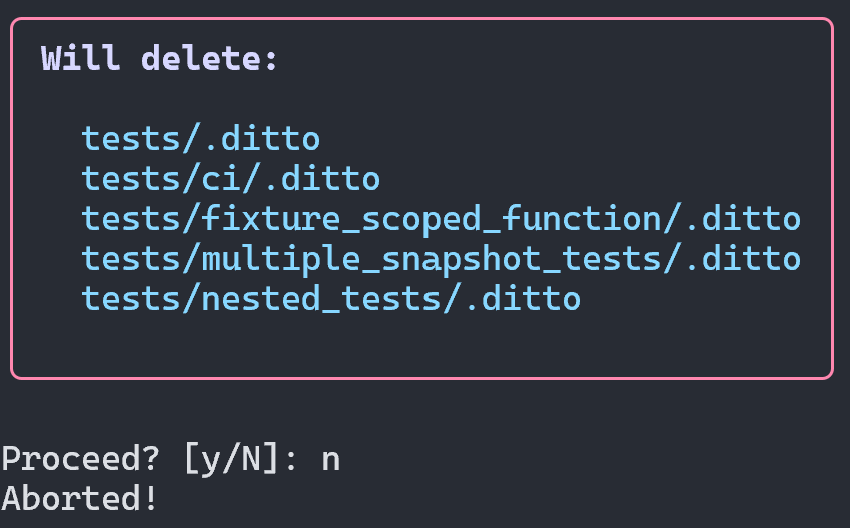

# ditto clean

Deletes all `.ditto/` directories under a path. Shows a preview and asks for
confirmation unless `--yes` is passed.

## Usage

```
ditto clean [PATH] [--yes]
```

## Examples

```bash
# Clean with confirmation prompt
ditto clean

# Clean without confirmation
ditto clean --yes

# Clean a specific directory
ditto clean tests/ci/ --yes
```

## Screenshot



## Behaviour

- Finds `.ditto/` directories under the given path, including PATH itself when
  it is a `.ditto` directory
- Skips symlinked `.ditto` entries (they are named, not followed or removed)
- Drops nested `.ditto` directories so a parent deletion is not repeated
- Shows a preview of what will be deleted
- Asks for confirmation (unless `--yes` is passed)
- Deletes the directories; a filesystem error on one directory is reported and
  the rest still run, then the command exits 1

!!! note
    `ditto clean` is local-only and never touches remote snapshots.
