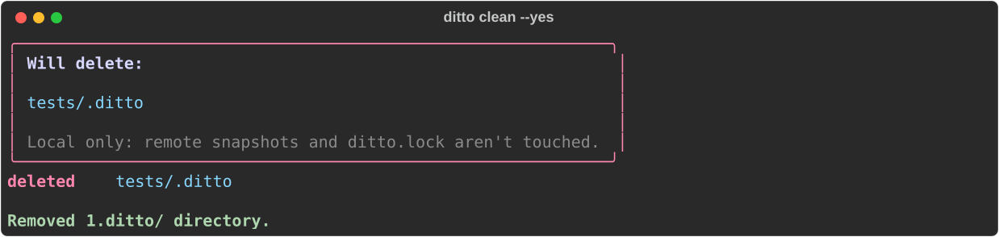

::: mkdocs-click
    :module: ditto.cli._maintenance
    :command: cmd_clean
    :prog_name: ditto clean
    :style: plain

## Examples

```bash
# Clean with confirmation prompt
ditto clean

# Clean without confirmation
ditto clean --yes

# Clean a specific directory
ditto clean tests/ci/ --yes
```

## Screenshot



## Behaviour

- Finds `.ditto/` directories under the given path, including PATH itself when
  it is a `.ditto` directory
- Skips symlinked `.ditto` entries (they are named, not followed or removed)
- Drops nested `.ditto` directories so a parent deletion is not repeated
- Shows a preview of what will be deleted, with paths relative to the current
  directory
- Asks for confirmation unless `--yes` is passed. Only `y` or `yes` deletes;
  Enter, `n` or end of input deletes nothing. It only asks at a terminal: when
  stdin isn't one (a pipe, CI), it deletes nothing and exits 1 unless `--yes`
  is passed, so a piped `y` is never taken as consent
- Deletes the directories; a filesystem error on one directory is reported and
  the rest still run, then the command exits 1

Finding nothing to delete, or declining at the prompt, exits 0.

!!! note
    `ditto clean` is local-only and never touches remote snapshots or
    `ditto.lock`.
