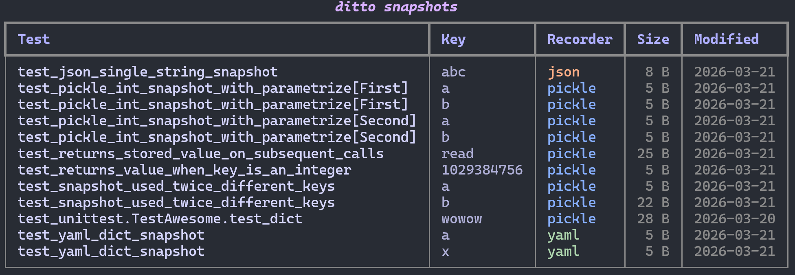

# ditto list

Lists all snapshot files found under a path in a table showing test name,
key, recorder, file size, and last-modified date.

## Usage

```
ditto list [PATH]
```

## Examples

```bash
# List all snapshots
ditto list

# List snapshots in a specific directory
ditto list tests/ci/
```

## Screenshot



## Output

Displays a table with columns:

| Column | Description |
|--------|-------------|
| Test | Test function name |
| Key | Snapshot key |
| Recorder | Format used (pkl, yaml, json, etc.) |
| Size | File size |
| Modified | Last-modified date |
