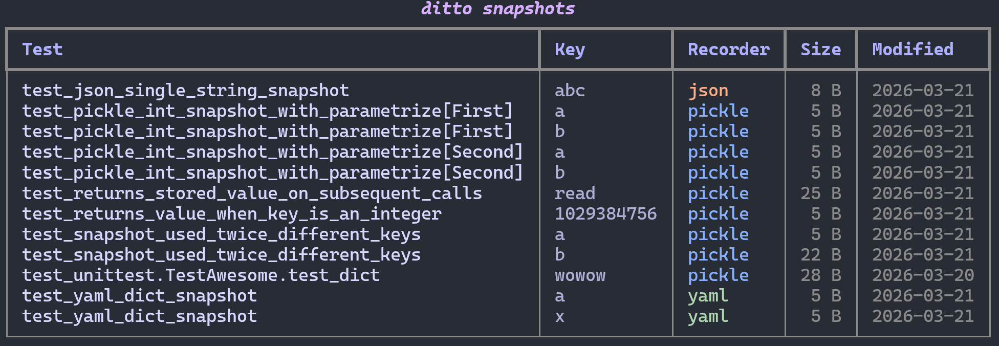

# ditto list

Lists all snapshot files found under a path in a table showing test name,
key, recorder, file size, and last-modified date.

## Usage

```
ditto list [PATH]
```

## Examples

```bash
# List all snapshots
ditto list

# List snapshots in a specific directory
ditto list tests/ci/
```

## Screenshot



## Output

Displays a table with columns:

| Column | Description |
|--------|-------------|
| Test | Test function name |
| Key | Snapshot key |
| Recorder | Format used (json, yaml, external formats, etc.) |
| Size | File size |
| Modified | Last-modified date |

## Data source

By default this command is **credential-free**: local snapshots are read from the
filesystem (real size and modified date, including on-disk orphans) and remote
snapshots are read from `ditto.lock` (shown with `—` for size and modified, since
physical metadata needs a live connection). No test modules are imported and no
credentials are needed.

Pass `--live` to read the live backends instead, via an internal
`pytest --setup-only` pass — authoritative physical state for every target, at the
cost of importing your tests and needing their credentials.

See [The Lock File](../guides/lock-file.md#declared-vs-physical-state-and-the-inventory-trade-off).
