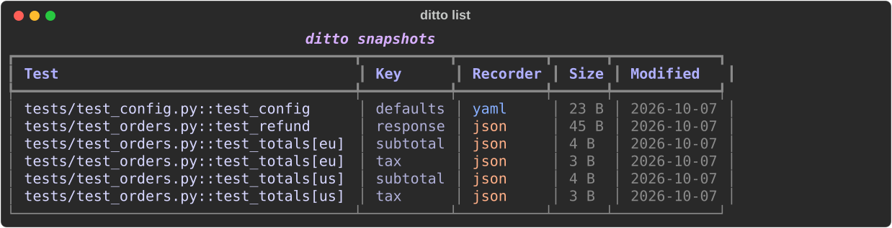

# ditto list

Lists all snapshot files found under a path in a table showing test name,
key, recorder, file size, and last-modified date.

## Usage

```
ditto list [PATH] [--test NODEID]... [--live]
```

## Examples

```bash
# List all snapshots
ditto list

# List snapshots in a specific directory
ditto list tests/ci/

# List the snapshots of one test, every case of a parametrized test, or a file
ditto list --test "tests/ci/test_api.py::test_totals[eu]"
ditto list --test tests/ci/test_api.py::test_totals
ditto list --test tests/ci/test_api.py --test tests/ci/test_export.py
```

## Selecting tests

`--test NODEID` keeps only the snapshots of the tests it names. It takes a node
id as pytest prints it, relative to the rootdir, or a prefix of one that ends
where the node id continues with `/`, `::` or `[`: a directory, a file, a class,
or a parametrized test (selecting all its cases). It never matches part of a
name, so `test_total` doesn't select `test_totals`. Repeat it to select several
tests; it combines with `PATH`, which still limits where snapshots are looked
for.

A snapshot's node id comes from `ditto.lock`, so `--test` can't match one the
lock doesn't record, such as an orphan or a snapshot written since the last
`ditto lock`. The command leaves those out and says how many there were. When
nothing matches, it lists nothing and exits 1, as `ditto list` does when it
finds no snapshots.

## Screenshot



## Output

Displays a table with columns:

| Column | Description |
|--------|-------------|
| Test | The test's node ID from `ditto.lock`; for a snapshot the lock doesn't record, the label from its stored name, marked `not in lock` |
| Key | Snapshot key |
| Recorder | Format used (json, yaml, external formats, etc.) |
| Size | File size |
| Modified | Last-modified date |

## Data source

By default this command is **credential-free**: local snapshots are read from the
filesystem (real size and modified date, including on-disk orphans) and remote
snapshots are read from `ditto.lock` (shown with `—` for size and modified, since
physical metadata needs a live connection). No test modules are imported and no
credentials are needed.

Pass `--live` to read the live backends instead, via an internal
`pytest --setup-only` pass — authoritative physical state for every target, at the
cost of importing your tests and needing their credentials.

See [The Lock File](../concepts/lock-file.md#declared-vs-physical-state-and-the-inventory-trade-off).
