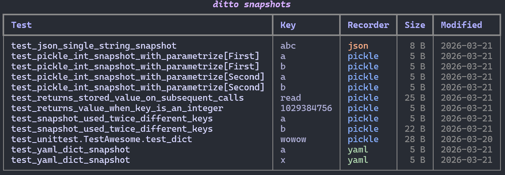

# ditto list

Lists every snapshot found under a path, grouped by target and test file, so
the part that tells two snapshots apart — the test and its key — keeps the
width instead of a repeated path.

## Usage

```
ditto list [OPTIONS] [PATH]
```

| Option | Description |
|--------|-------------|
| `--live` | Read the live backends instead of the lock (see [Data source](#data-source)) |
| `--flat` | One row per snapshot with its whole node id, nothing grouped — for `grep` and scripts |

## Examples

```bash
# List all snapshots
ditto list

# List snapshots owned by tests under a directory
ditto list tests/ci/

# One row per snapshot, with the full node id
ditto list --flat
```

## Screenshot



## Output

A table, laid out to fit the terminal:

| Column | Description |
|--------|-------------|
| Target / test | The target as a path relative to the current directory (a remote URI is shown whole), then the test file, then the test name |
| Key | Snapshot key, exactly as `ditto.lock` records it |
| Recorder | Format used (json, yaml, external formats, etc.) |
| Size | File size, or `—` when the inventory has no size for it |
| Modified | Last-modified date, or `—` |

A snapshot is named by the test that owns it, its key, and its recorder —
the same three facts everywhere ditto names a snapshot. The file heading is
printed once for all the snapshots in it, and a name `ditto.lock` doesn't
record (an orphan, or a snapshot recorded since the last `ditto lock`) is
listed after the files and marked `not in lock`.

The table adapts to the terminal width: below 60 columns a snapshot's key and
recorder move under its name, and below 80 the size and date share a cell.
Nothing is truncated — a long name wraps in the middle, so the part that tells
two rows apart stays visible.

A footnote gives the totals, for example `4 snapshots · 2 targets`.

Use `--flat` when a script needs one line per snapshot with the whole node id
on it:

```
$ ditto list --flat
ditto snapshots
╭──────────────────────────────────┬────────┬──────────┬──────┬────────────╮
│ Target / test                    │ Key    │ Recorder │ Size │ Modified   │
├──────────────────────────────────┼────────┼──────────┼──────┼────────────┤
│ tests/.ditto                     │        │          │      │            │
│ tests/test_a.py::test_numbers[1] │ value  │ json     │ 13 B │ 2025-09-28 │
│ tests/test_a.py::test_frame      │ df     │ json     │  2 B │ 2025-09-28 │
╰──────────────────────────────────┴────────┴──────────┴──────┴────────────╯
2 snapshots · 1 target
```

## Data source

By default this command is **credential-free**: local snapshots are read from the
filesystem (real size and modified date, including on-disk orphans) and remote
snapshots are read from `ditto.lock` (shown with `—` for size and modified, since
physical metadata needs a live connection). No test modules are imported and no
credentials are needed.

Pass `--live` to read the live backends instead, via an internal
`pytest --setup-only` pass — authoritative physical state for every target, at the
cost of importing your tests and needing their credentials.

See [The Lock File](../guides/lock-file.md#declared-vs-physical-state-and-the-inventory-trade-off).
