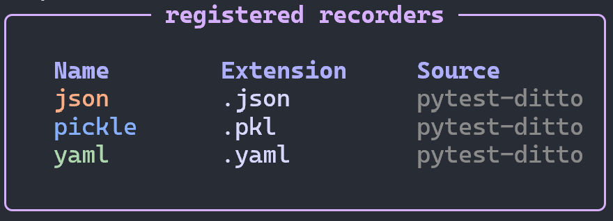

# ditto recorders

Lists all registered recorder plugins, showing their name, identifier,
and the source package they come from.

## Usage

```
ditto recorders
```

## Screenshot



## Output

Displays a table with columns:

| Column | Description |
|--------|-------------|
| Name | Registry key (e.g., `json`, `pandas_parquet`) |
| Identifier | Persisted identifier, as a snapshot file suffix (e.g., `.json`, `.pandas.parquet`) |
| Package | Source package (e.g., `pytest-ditto`, `pytest-ditto-pandas`) |
