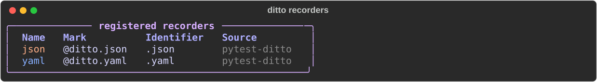

::: mkdocs-click
    :module: ditto.cli._maintenance
    :command: cmd_recorders
    :prog_name: ditto recorders
    :style: plain

It reads installed package metadata only and imports no plugin. If any
registrations break the plugin contract, it says how many and points to
[`ditto doctor`](doctor.md).

## Screenshot

## Output

Displays a table with columns:

| Column | Description |
|--------|-------------|
| Name | Recorder name, as used in `@ditto.record("name")` (e.g., `json`, `pandas.parquet`) |
| Mark | Mark derived from the name (e.g., `@ditto.json`, `@ditto.pandas.parquet`) |
| Identifier | Snapshot file suffix, taken from the name (e.g., `.json`, `.pandas.parquet`) |
| Source | Package the recorder comes from (e.g., `pytest-ditto`, `pytest-ditto-pandas`) |
