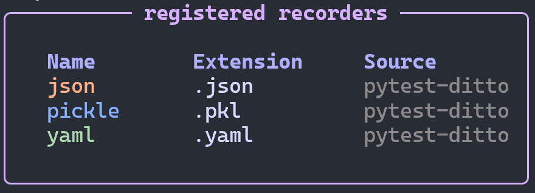

# ditto recorders

Lists all registered recorder plugins, showing their name, the mark derived
from it, and the source package they come from. It reads installed package
metadata only and imports no plugin. If any registrations break the plugin
contract, it says how many and points to `ditto doctor`.

## Usage

```
ditto recorders
```

## Screenshot



## Output

A table laid out to fit the terminal:

| Column | Description |
|--------|-------------|
| Name | Recorder name, as used in `@ditto.record("name")` (e.g., `json`, `pandas.parquet`) |
| Mark | Mark derived from the name (e.g., `@ditto.json`, `@ditto.pandas.parquet`) |
| Source | Source package (e.g., `pytest-ditto`, `pytest-ditto-pandas`) |

The table is sized by its content, so the columns line up and a long plugin
name does not push the others out of line. Plugin names are the longest strings
here and this is where they were pushed out of line.

An **Identifier** column — the snapshot file suffix, taken from the name — is
shown only when at least one recorder's identifier isn't just `.` + its name,
which is what the plugin contract requires of all of them. It is left out
otherwise, since a column of values derived from the name beside it adds width
without adding information.
