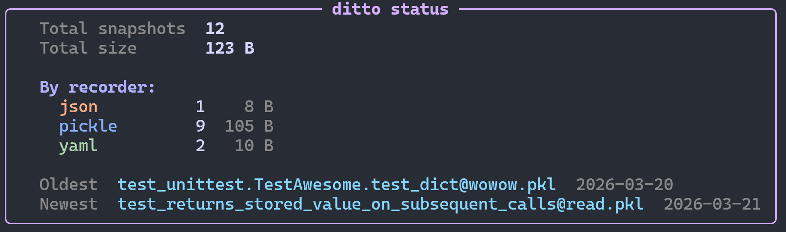

# ditto status

Shows aggregate statistics: total count, total size, breakdown by recorder
type, and oldest/newest snapshot dates.

## Usage

```
ditto status [PATH]
```

## Examples

```bash
# Show status for all snapshots
ditto status

# Show status for a specific directory
ditto status tests/ci/
```

## Screenshot



## Output

Displays:

- Total snapshot count
- Total size on disk
- Breakdown by recorder type (count and size)
- Oldest and newest snapshot dates

## Data source

By default this command is **credential-free**: local snapshots are read from the
filesystem (real size and modified date, including on-disk orphans) and remote
snapshots are read from `ditto.lock` (shown with `—` for size and modified, since
physical metadata needs a live connection). No test modules are imported and no
credentials are needed.

Pass `--live` to read the live backends instead, via an internal
`pytest --setup-only` pass — authoritative physical state for every target, at the
cost of importing your tests and needing their credentials.

Totals cover only snapshots with a known size; remote (lock-derived) snapshots are
reported separately as "size unknown (use --live)".

See [The Lock File](../guides/lock-file.md#declared-vs-physical-state-and-the-inventory-trade-off).
