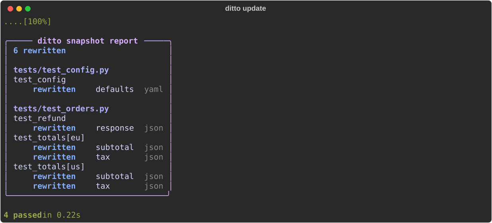

::: mkdocs-click
    :module: ditto.cli._pytest
    :command: cmd_update
    :prog_name: ditto update
    :style: plain

## Examples

```bash
# Update all snapshots
ditto update

# Update snapshots in a specific directory
ditto update tests/ci/

# Update specific tests
ditto update tests/ci/ -k test_foo
```

## Screenshot



## Behaviour

- Runs pytest with `--ditto-update` flag
- Every snapshot encountered during the run is re-recorded from current output
- Existing snapshot files are overwritten
- New snapshots are created as normal

!!! tip
    After updating, review the diff in version control to verify the changes
    are intentional.
