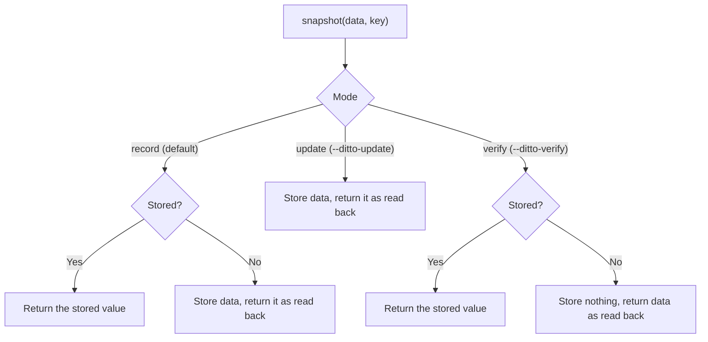

# How Snapshots Work

The `snapshot` fixture is the core of pytest-ditto. It stores a test's output
the first time the test runs, and gives it back on every later run so the test
can check that the output hasn't changed.

## The `snapshot` fixture

```python
def test_fn(snapshot) -> None:
    result = compute_something()
    assert result == snapshot(result, key="something")
```

The `snapshot` callable takes two arguments:

- **`data`**: the value to snapshot. It must be a value the test's
  [recorder](../guides/recorders.md) accepts; the default, strict JSON,
  rejects tuples, sets, dates and other values outside its data model.
- **`key`**: a string naming this snapshot, unique within the test. A key that
  isn't a `str` raises `TypeError`.

`snapshot()` returns the value for the test to compare against. That value is
always what the recorder reads back, never `data` itself, so a test sees on its
first run exactly what every later run will see.

## Record, update and verify

What `snapshot()` does depends on the run's mode and on whether the snapshot is
already stored:



| Mode | Snapshot stored | Snapshot missing |
|---|---|---|
| **record**: a plain `pytest` run | Returns the stored value. | Stores `data`, then returns it as read back. |
| **update**: `ditto update`, `--ditto-update` | Overwrites it with `data`, then returns `data` as read back. | Stores `data`, then returns it as read back. |
| **verify**: `ditto verify`, `--ditto-verify` | Returns the stored value. | Stores nothing and returns `data` as read back; the run then fails, reporting the snapshot. |

"As read back" means `data` is serialised and deserialised before it is
returned, and nothing is stored if the recorder can't read its own output. So a
value the recorder doesn't store exactly fails on the run that records it,
rather than on the next one. The YAML recorder, for example, reads a tuple back
as a list:

<!-- test: fails -->
```python
import ditto


@ditto.yaml
def test_pair(snapshot):
    assert (1, 2) == snapshot((1, 2), key="pair")  # fails: (1, 2) != [1, 2]
```

Snapshot a list instead, or choose a recorder that keeps the distinction.

!!! warning "A missing snapshot passes in record mode"
    In record mode a missing snapshot is stored and the test passes, so a
    deleted or renamed snapshot is silently re-recorded from the code's current
    output. In CI, run [`ditto verify`](../cli/verify.md): it never writes, and
    it fails on any missing snapshot.

## Several snapshots in one test

Give each snapshot its own key:

```python
def test_pipeline(snapshot):
    raw = fetch_data()
    processed = transform(raw)

    assert raw == snapshot(raw, key="raw_input")
    assert processed == snapshot(processed, key="transformed")
```

Using the same key twice in one test raises `DuplicateSnapshotKeyError`:

<!-- test: fails -->
```python
def test_bad(snapshot):
    snapshot(1, key="x")
    snapshot(2, key="x")  # raises DuplicateSnapshotKeyError
```

## Choosing a recorder and a target

A test's snapshots use the strict JSON recorder and are stored in a `.ditto/`
directory next to the test file, unless a `record` mark says otherwise. The
mark names a [recorder](../guides/recorders.md), and can also name a
[target](../guides/backends.md), the place snapshots are stored:

```python
import ditto


@ditto.yaml
def test_config(snapshot): ...


@ditto.record("json", target="s3://my-bucket/snapshots/")
def test_remote(snapshot): ...
```

`@ditto.yaml` is shorthand for `@ditto.record("yaml")`, and takes the same
keyword arguments: `@ditto.yaml(target="s3://my-bucket/snapshots/")`. A target
always comes with a recorder: `@ditto.record(target=...)` on its own is an
error, so use `@ditto.json(target=...)` for the default format.

A mark applies to a test function, or to every test in a class or module when
set there, for example with `pytestmark = ditto.yaml`. A test can have only
one `record` mark: a function mark on top of a class or module mark raises
`AdditionalMarkError` rather than overriding it.

## Where snapshots are stored

Each snapshot is stored under a name built from its test module, test, key and
recorder, such as
`tests/.ditto/tests.test_api.test_response@body~234c7156f10c6aa4.json`. See
[Snapshot Names](naming.md).

A snapshot test must live under pytest's rootdir, because its name starts with
the test file's path relative to the rootdir. A test outside it fails with an
error that says so.

## Keeping snapshots current

When your code's output changes on purpose, re-record its snapshots with
`ditto update`. When you remove or rename tests, rebuild the lock with
`ditto lock` and delete the snapshots nothing uses with `ditto prune`. See
[Maintaining Snapshots](../guides/maintaining.md).
