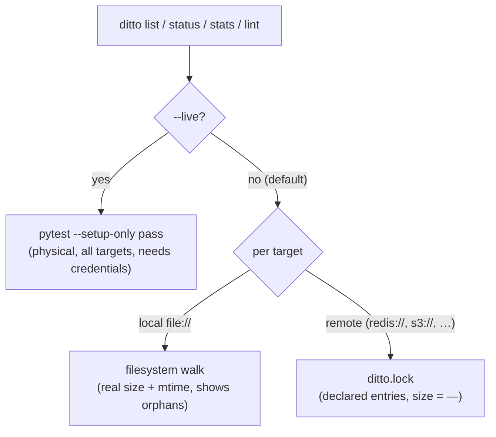

# The Lock File

`ditto.lock` is a tool-generated, committed, PR-reviewed file that records which
snapshots your test suite legitimately owns. It is the source of truth behind
`ditto verify`, `ditto prune`, and the credential-free CLI inventory.

It is modelled on `package-lock.json`, `Cargo.lock`, and `poetry.lock`: never
hand-edited, deterministic, merge-friendly, and reviewed as part of the diff.

## Why a committed file

A snapshot is "legitimate" only if your suite is supposed to own it. That fact
cannot be derived from which tests happened to run in one session, and a
throwaway cache cannot survive a fresh CI checkout. `ditto.lock` persists it: it
is committed, so a clean checkout — or a partial, failed, or parallel run — still
knows the full, authoritative set.

Commit `ditto.lock`. Do **not** add it to `.gitignore`; ditto warns when it is
ignored.

## What it records

For each resolved **target** (a backend URI such as the local `.ditto/`
directory or `redis://…`), the lock stores one entry per snapshot: the test
`nodeid`, the snapshot `key`, and the recorder. It records the targets your tests
actually used — including per-test `record(target=…)` marks — because it is
written by real runs. It never stores credentials or `storage_options`.

## How it is produced and maintained

| Command | Effect on `ditto.lock` |
|---|---|
| `pytest` (normal run) | Appends entries for any snapshots recorded this run. |
| `ditto lock` (`pytest --ditto-lock`) | Rebuilds the lock from a full run (authoritative; drops stale entries). Refuses on a partial/filtered run. |
| `ditto update` (`pytest --ditto-update`) | On a full run, reconciles the lock (drops entries for deleted tests); on a filtered run, appends only. |
| `ditto prune` (`pytest --ditto-prune`) | Does **not** write the lock; deletes backend snapshots absent from it. |

Owned-prefix scoping keeps a shared backend safe: ditto only considers keys under
the modules your suite owns, so two suites or branches sharing one backend never
delete each other's data.

## How the lock is used

- **`ditto verify`** — diffs the live backend against the lock and fails on drift
  (missing, orphan, or unsynced snapshots). See [ditto verify](../cli/verify.md).
- **`ditto prune`** — deletes backend snapshots that are not in the lock, never a
  snapshot created during the same run. See [ditto prune](../cli/prune.md).
- **CLI inventory** (`list`/`status`/`stats`/`lint`) — reads the lock for a fast,
  credential-free remote inventory (below).

## Declared vs physical state (and the inventory trade-off)

The lock is a **declared** record — what is *legitimate* — not a **physical** one
— what is *actually stored*. They can diverge: a snapshot deleted from the backend
but still in the lock (missing), or an orphan in the backend not in the lock.
Detecting that divergence is exactly what `ditto verify` is for.

This shapes how the read-only inventory commands source their data:

- **Local file targets are read from disk** — real sizes and mtimes, including
  on-disk orphans not in the lock — instantly and without credentials.
- **Remote targets are read from the lock** — credential-free, but size and
  mtime are unknown (shown as `—`).
- **`--live`** runs the pytest introspection pass for authoritative physical
  state across every target. It imports your test modules and needs the same
  credentials your test run needs.

The reason for the split is a hard asymmetry: reading a local file's true state
is free (a `stat`), but reading a remote backend's true state requires connecting
to it, which is credential-gated. You can have at most two of *{uniform
behaviour, true physical state, fast & credential-free}* — ditto's default keeps
inventory fast and credential-free, and offers truth on demand via `--live`.
