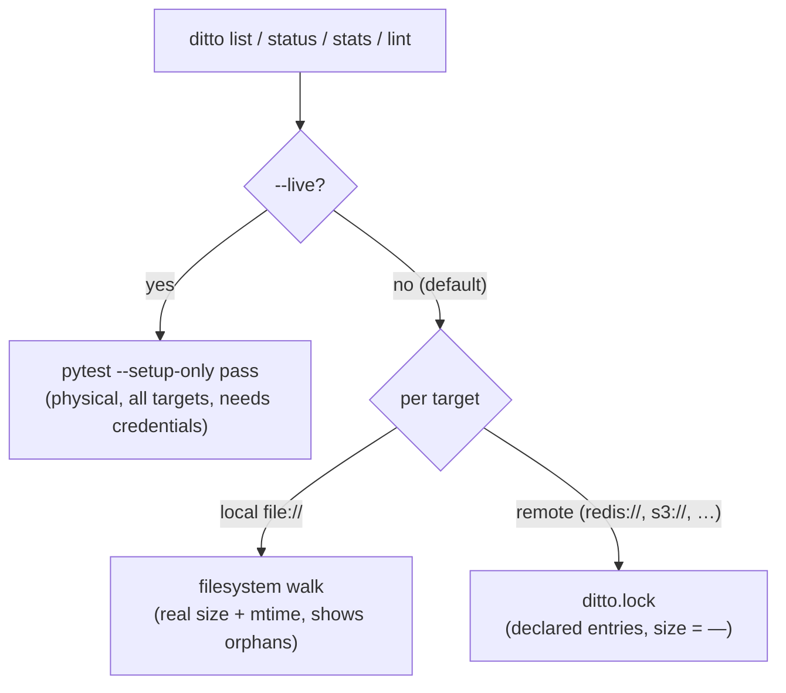

# The Lock File

`ditto.lock` is a tool-generated, committed, PR-reviewed file that records which
snapshots your test suite legitimately owns. It is the source of truth behind
`ditto verify`, `ditto prune`, and the credential-free CLI inventory.

It is modelled on `package-lock.json`, `Cargo.lock`, and `poetry.lock`: never
hand-edited, deterministic, merge-friendly, and reviewed as part of the diff.

## Why a committed file

A snapshot is "legitimate" only if your suite is supposed to own it. That fact
cannot be derived from which tests happened to run in one session, and a
throwaway cache cannot survive a fresh CI checkout. `ditto.lock` persists it: it
is committed, so a clean checkout — or a partial, failed, or parallel run — still
knows the full, authoritative set.

Commit `ditto.lock`. Do **not** add it to `.gitignore`; ditto warns when it is
ignored.

## What it records

For each resolved **target** (a backend URI such as the local `.ditto/`
directory or `redis://…`), the lock stores one entry per snapshot: the test
`nodeid`, the snapshot `key`, and the recorder. It records the targets your tests
actually used — including per-test `record(target=…)` marks — because it is
written by real runs. It never stores `storage_options`, but it does store each
target URI verbatim, so ditto refuses a target URI that contains a password or
a secret query parameter; pass credentials as
[storage options](backends.md#credentials-and-connection-settings-ditto_storage_options),
or in a profile's `storage_options`, instead.

## How it is produced and maintained

| Command | Effect on `ditto.lock` |
|---|---|
| `pytest` (normal run) | Appends entries for any snapshots recorded this run. If it can't write the lock, it warns and the run still passes. |
| `ditto lock` (`pytest --ditto-lock`) | Rebuilds the lock from a full run (authoritative; drops stale entries). Refuses on a partial/filtered run. If it can't write the lock, the run fails. |
| `ditto update` (`pytest --ditto-update`) | On a full run, reconciles the lock (drops entries for deleted tests), and the run fails if it can't write the lock; on a filtered run, appends only. |
| `ditto prune` (`pytest --ditto-prune`) | Does **not** write the lock; deletes backend snapshots absent from it. |

A rebuild works test by test. A test that passed this run has its entries
replaced by the snapshots it used. A test that didn't run its body to a pass
keeps its entries: one that was skipped (for example by a platform `skipif`, or
a module-level `pytest.skip` or `pytest.importorskip`), xfailed, deselected with
`--deselect`, or in a path pytest didn't collect (`--ignore`, `--ignore-glob`,
a `conftest.py` `collect_ignore` or `collect_ignore_glob`, or `norecursedirs`).
Entries for tests that no longer exist are dropped, which is what cleans up
after a renamed or deleted test. A skip on one machine therefore never removes
a snapshot that another machine still runs.

### Sharing a target

`ditto verify` and `ditto prune` only look at keys under the test modules your
suite owns, so another suite with different module paths on the same backend is
left alone. What they can't tell apart is anyone else with the same module
paths: another branch of the same project, or another project that also has
`tests/test_api.py`. On a target they both write to, a snapshot that only the
other has recorded looks like an orphan. `ditto verify` reports it as drift,
and `ditto prune` would delete it.

So give each project, and each branch whose tests can differ, its own target
path, for example `s3://bucket/<project>/<branch>/`. In CI, you can pass it
on the command line with the branch name filled in:
`pytest -o "ditto_target=s3://bucket/my-project/$BRANCH/"`.

Because ditto can't check that a target is used by one checkout only, `ditto
prune` deletes nothing from one that might be shared unless you pass
`--shared` (`pytest --ditto-prune-shared`). Without it, prune says how many
snapshots it left in each such target and the run fails. A target might be
shared when it is anything other than a `file://` path inside the project,
such as the default `.ditto`: a remote URI, or a `file://` path outside the
project. `ditto prune --check` lists what would be deleted either way.

## How the lock is used

- **`ditto verify`** — diffs the live backend against the lock and fails on drift
  (missing, orphan, or unsynced snapshots). See [ditto verify](../cli/verify.md).
- **`ditto prune`** — deletes backend snapshots that are not in the lock, never a
  snapshot created during the same run. See [ditto prune](../cli/prune.md).
- **CLI inventory** (`list`/`status`/`stats`/`lint`) — reads the lock for a fast,
  credential-free remote inventory (below).

## Running under pytest-xdist

Snapshot tests run under pytest-xdist distribution (`-n N`, or `--dist` with
`--tx`): each worker records and compares its own tests' snapshots. What doesn't
work is anything that has to see the whole run in one process, because the tests
run in the workers and no single process sees them all:

| Under distribution | Behaviour |
|---|---|
| `pytest` / `ditto update` | Snapshots are recorded and compared as usual. `ditto.lock` is not updated; ditto warns. |
| `ditto verify` (`--ditto-verify`) | Refused. |
| `ditto lock` (`--ditto-lock`) | Refused. |
| `ditto prune` (`--ditto-prune`, `--ditto-prune-dry-run`) | Refused. |
| Snapshot report | Not printed. |

A refused mode is a usage error (exit code 4) raised before any test runs, so it
writes no snapshots, leaves the lock as it was, and deletes nothing.

A typical CI setup runs the tests in parallel, then checks the lock in a
separate single-process run:

```bash
pytest -n auto
ditto verify
```

If your pytest configuration adds `-n` through `addopts`, pass `-n 0` to the
single-process commands, for example `ditto verify -n 0`.

## Declared vs physical state (and the inventory trade-off)

The lock is a **declared** record — what is *legitimate* — not a **physical** one
— what is *actually stored*. They can diverge: a snapshot deleted from the backend
but still in the lock (missing), or an orphan in the backend not in the lock.
Detecting that divergence is exactly what `ditto verify` is for.

This shapes how the read-only inventory commands source their data:


```mermaid
flowchart TD
    C["ditto list / status / stats / lint"] --> L{"--live?"}
    L -- "yes" --> P["pytest --setup-only pass<br/>(physical, all targets, needs credentials)"]
    L -- "no (default)" --> T{"per target"}
    T -- "local file://" --> F["filesystem walk<br/>(real size + mtime, shows orphans)"]
    T -- "remote (redis://, s3://, …)" --> K["ditto.lock<br/>(declared entries, size = —)"]
```

- **Local file targets are read from disk** — real sizes and mtimes, including
  on-disk orphans not in the lock — instantly and without credentials.
- **Remote targets are read from the lock** — credential-free, but size and
  mtime are unknown (shown as `—`).
- **`--live`** runs the pytest introspection pass for authoritative physical
  state across every target. It imports your test modules and needs the same
  credentials your test run needs.

The reason for the split is a hard asymmetry: reading a local file's true state
is free (a `stat`), but reading a remote backend's true state requires connecting
to it, which is credential-gated. You can have at most two of *{uniform
behaviour, true physical state, fast & credential-free}* — ditto's default keeps
inventory fast and credential-free, and offers truth on demand via `--live`.
