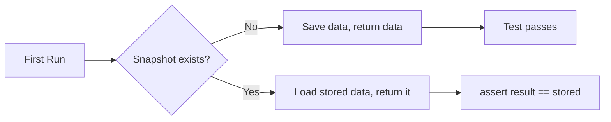

# The Snapshot Fixture

The `snapshot` fixture is the core of pytest-ditto. It records and replays
test outputs for regression testing.

## Basic Usage

```python
def test_fn(snapshot) -> None:
    result = compute_something()
    assert result == snapshot(result, key="something")
```

The `snapshot` callable takes two arguments:

- **`data`** — the value to snapshot (any serialisable object)
- **`key`** — a unique identifier within this test

## How It Works



1. **First run (recording):** No stored snapshot exists. The fixture saves `data`
   to the configured backend and returns it. Since `assert data == data`, the
   test passes.

2. **Subsequent runs (replay):** The stored snapshot is loaded and returned.
   The test asserts that the current result matches the stored value.

## Multiple Snapshots Per Test

Use distinct keys for each snapshot within a test:

```python
def test_pipeline(snapshot):
    raw = fetch_data()
    processed = transform(raw)
    
    assert raw == snapshot(raw, key="raw_input")
    assert processed == snapshot(processed, key="transformed")
```

## Duplicate Key Detection

Using the same key twice in a single test raises
`DuplicateSnapshotKeyError`:

```python
def test_bad(snapshot):
    snapshot(1, key="x")
    snapshot(2, key="x")  # raises DuplicateSnapshotKeyError
```

## Snapshot Storage Location

By default, snapshots are stored in a `.ditto/` directory adjacent to the
test file. The filename format is:

```
.ditto/<module>.<group>@<key>.<extension>
```

For example, a test in `tests/test_api.py`:

```python
@ditto.json
def test_response(snapshot):
    data = get_response()
    assert data == snapshot(data, key="body")
```

Stores to: `.ditto/test_api.test_response@body.json`

## Updating Snapshots

When your code intentionally changes behaviour, regenerate snapshots:

```bash
pytest --ditto-update
# or
ditto update
```

## Pruning Stale Snapshots

Remove snapshots that are no longer used by any test:

```bash
pytest --ditto-prune
# or
ditto prune
```

!!! warning
    Using `-k` for a partial test run may falsely classify snapshots for
    un-run tests as unused.
