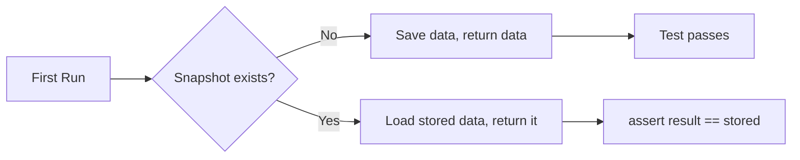

# The Snapshot Fixture

The `snapshot` fixture is the core of pytest-ditto. It records and replays
test outputs for regression testing.

## Basic Usage

```python
def test_fn(snapshot) -> None:
    result = compute_something()
    assert result == snapshot(result, key="something")
```

The `snapshot` callable takes two arguments:

- **`data`** — the value to snapshot (any serialisable object)
- **`key`** — a unique identifier within this test

## How It Works


```mermaid
graph LR
    A[First Run] --> B{Snapshot exists?}
    B -->|No| C[Save data, return data]
    B -->|Yes| D[Load stored data, return it]
    C --> E[Test passes]
    D --> F[assert result == stored]
```

1. **First run (recording):** No stored snapshot exists. The fixture saves `data`
   to the configured backend and returns it. Since `assert data == data`, the
   test passes.

2. **Subsequent runs (replay):** The stored snapshot is loaded and returned.
   The test asserts that the current result matches the stored value.

## Multiple Snapshots Per Test

Use distinct keys for each snapshot within a test:

```python
def test_pipeline(snapshot):
    raw = fetch_data()
    processed = transform(raw)
    
    assert raw == snapshot(raw, key="raw_input")
    assert processed == snapshot(processed, key="transformed")
```

## Duplicate Key Detection

Using the same key twice in a single test raises
`DuplicateSnapshotKeyError`:

```python
def test_bad(snapshot):
    snapshot(1, key="x")
    snapshot(2, key="x")  # raises DuplicateSnapshotKeyError
```

## Snapshot Storage Location

By default, snapshots are stored in a `.ditto/` directory adjacent to the
test file. The filename format is:

```
.ditto/<module>.<test>@<key>~<hash>.<recorder>
```

For example, with the project root as pytest's rootdir, a test in
`tests/test_api.py`:

```python
@ditto.json
def test_response(snapshot):
    data = get_response()
    assert data == snapshot(data, key="body")
```

Stores to: `tests/.ditto/tests.test_api.test_response@body~234c7156f10c6aa4.json`

A key can be any string, and the test name includes any parametrize ID, so
either can hold characters a file name can't. In the file name, characters other
than ASCII letters, digits and `. _ - [ ] = , +` become `_`. The hash, from the
test's exact node ID, the key and the recorder, keeps names apart that would
otherwise match:

| Test | File |
|---|---|
| `test_at[12:00]` | `tests.test_api.test_at[12_00]@body~6617c5399a6ba420.json` |
| `test_at[12_00]` | `tests.test_api.test_at[12_00]@body~105d78e147145d58.json` |
| `test_at[A]` | `tests.test_api.test_at[A]@body~46cccc8d4a59c1ef.json` |
| `test_at[a]` | `tests.test_api.test_at[a]@body~a99f8460327efdf4.json` |

`ditto.lock` records the exact test and key, and `ditto list` shows them. See
[Storage Backends](backends.md#local-files-file) for the full naming rules.

## Updating Snapshots

When your code intentionally changes behaviour, regenerate snapshots:

```bash
pytest --ditto-update
# or
ditto update
```

## Pruning Stale Snapshots

Remove snapshots that are no longer used by any test:

```bash
pytest --ditto-prune
# or
ditto prune
```

!!! warning
    Using `-k` for a partial test run may falsely classify snapshots for
    un-run tests as unused.
