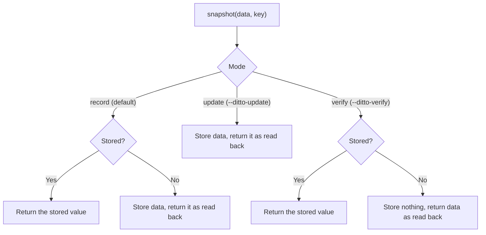

# The Snapshot Fixture

The `snapshot` fixture is the core of pytest-ditto. It records and replays
test outputs for regression testing.

## Basic Usage

```python
def test_fn(snapshot) -> None:
    result = compute_something()
    assert result == snapshot(result, key="something")
```

The `snapshot` callable takes two arguments:

- **`data`**: the value to snapshot. It must be a value the test's
  [recorder](recorders.md) accepts; the default, strict JSON, rejects tuples,
  sets, dates and other values outside its data model.
- **`key`**: a string naming this snapshot, unique within the test. A key that
  isn't a `str` raises `TypeError`.

`snapshot()` returns the value for the test to compare against. That value is
always what the recorder reads back, never `data` itself, so a test sees on its
first run exactly what every later run will see.

## How It Works

What `snapshot()` does depends on the run's mode and on whether the snapshot is
already stored:


```mermaid
graph TD
    A["snapshot(data, key)"] --> B{Mode}
    B -->|"record (default)"| C{Stored?}
    C -->|Yes| D[Return the stored value]
    C -->|No| E[Store data, return it as read back]
    B -->|"update (--ditto-update)"| F[Store data, return it as read back]
    B -->|"verify (--ditto-verify)"| G{Stored?}
    G -->|Yes| H[Return the stored value]
    G -->|No| I[Store nothing, return data as read back]
```

| Mode | Snapshot stored | Snapshot missing |
|---|---|---|
| **record**: a plain `pytest` run | Returns the stored value. | Stores `data`, then returns it as read back. |
| **update**: `ditto update`, `--ditto-update` | Overwrites it with `data`, then returns `data` as read back. | Stores `data`, then returns it as read back. |
| **verify**: `ditto verify`, `--ditto-verify` | Returns the stored value. | Stores nothing and returns `data` as read back; the run then fails, reporting the snapshot. |

"As read back" means `data` is serialised and deserialised before it is
returned, and nothing is stored if the recorder can't read its own output. So a
value the recorder doesn't store exactly fails on the run that records it,
rather than on the next one. The YAML recorder, for example, reads a tuple back
as a list:

```python
@ditto.yaml
def test_pair(snapshot):
    assert (1, 2) == snapshot((1, 2), key="pair")  # fails: (1, 2) != [1, 2]
```

Snapshot a list instead, or choose a recorder that keeps the distinction.

!!! warning "A missing snapshot passes in record mode"
    In record mode a missing snapshot is stored and the test passes, so a
    deleted or renamed snapshot is silently re-recorded from the code's current
    output. In CI, run [`ditto verify`](../cli/verify.md): it never writes, and
    it fails on any missing snapshot.

## Multiple Snapshots Per Test

Use distinct keys for each snapshot within a test:

```python
def test_pipeline(snapshot):
    raw = fetch_data()
    processed = transform(raw)
    
    assert raw == snapshot(raw, key="raw_input")
    assert processed == snapshot(processed, key="transformed")
```

## Duplicate Key Detection

Using the same key twice in a single test raises
`DuplicateSnapshotKeyError`:

```python
def test_bad(snapshot):
    snapshot(1, key="x")
    snapshot(2, key="x")  # raises DuplicateSnapshotKeyError
```

## Snapshot Storage Location

By default, snapshots are stored in a `.ditto/` directory adjacent to the
test file. The filename format is:

```
.ditto/<module>.<test>@<key>~<hash>.<recorder>
```

For example, with the project root as pytest's rootdir, a test in
`tests/test_api.py`:

```python
@ditto.json
def test_response(snapshot):
    data = get_response()
    assert data == snapshot(data, key="body")
```

Stores to: `tests/.ditto/tests.test_api.test_response@body~234c7156f10c6aa4.json`

A key can be any string, and the test name includes any parametrize ID, so
either can hold characters a file name can't. In the file name, characters other
than ASCII letters, digits and `. _ - [ ] = , +` become `_`. The hash, from the
test's exact node ID, the key and the recorder, keeps names apart that would
otherwise match:

| Test | File |
|---|---|
| `test_at[12:00]` | `tests.test_api.test_at[12_00]@body~6617c5399a6ba420.json` |
| `test_at[12_00]` | `tests.test_api.test_at[12_00]@body~105d78e147145d58.json` |
| `test_at[A]` | `tests.test_api.test_at[A]@body~46cccc8d4a59c1ef.json` |
| `test_at[a]` | `tests.test_api.test_at[a]@body~a99f8460327efdf4.json` |

`ditto.lock` records the exact test and key, and `ditto list` shows them. See
[Storage Backends](backends.md#local-files-file) for the full naming rules.

## Updating Snapshots

When your code intentionally changes behaviour, regenerate snapshots:

```bash
pytest --ditto-update
# or
ditto update
```

## Pruning Stale Snapshots

Removing or renaming a test or a snapshot key leaves its old snapshot in
storage. Rebuild the lock so it stops recording the old snapshot, then delete
every stored snapshot the lock doesn't record:

```bash
ditto lock
ditto prune
```

`ditto prune --check` lists what would be deleted without deleting anything.
See [ditto prune](../cli/prune.md) and [The Lock File](lock-file.md).
